# ContextForge

**Use as many AIs as you like on one game project — without losing context, and without breaking a dependency.**

ContextForge is a desktop app for game development with LLMs. It reads your real
project off disk, works out the dependency graph, builds the context an AI needs
for the specific thing you are asking about, and applies the AI's edits back —
through a patch engine that refuses to guess.

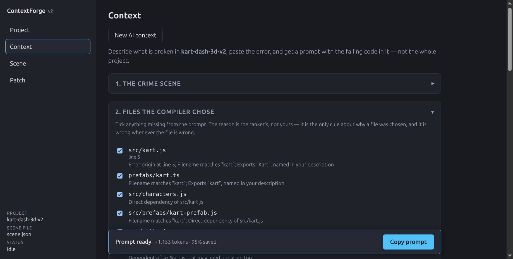

---

## Why it exists

Building a game with an AI runs into four failure modes, and all four come from
the same root: **the AI does not actually know your project.**

1. **Context loss.** The AI invents functions that do not exist, or duplicates
   ones that already do.
2. **Broken dependencies.** It edits a file without knowing what imports it, and
   the thing stops working three files away.
3. **Wasted tokens.** You paste the whole project into every prompt to work
   around (1) and (2), and pay for the irrelevant 95% every time.
4. **Unreviewable writes.** The AI writes straight to disk, so a wrong change is
   a mess of half-applied edits rather than a diff you looked at first.

ContextForge's answer is not "a better prompt". It is a real graph of your
project, extracted from the source, used to *choose* context rather than dump
it — and a patch format where nothing is written until you have seen the diff.

The AI it talks to is whichever one you are already using. ContextForge makes no
network calls of its own.

---

## What it does

Every claim below is backed by a test in `packages/*/test/`. `npm run verify`
runs all of them: **65 test files, 1258 tests, green.**

### Sees the whole project at once

The **Graph** screen draws the file-level dependency graph the extractors
produced, straight from your project on disk. Click any file to narrow to its
neighbourhood — depth 1 or 2, in both directions, because a developer editing
`kart.ts` needs the two karts that import it as much as the modules it imports.

The **Unreferenced** drawer lists files nothing imports, and — the part that
matters — says *why* each one is flagged. An entry point (`index.html`,
`main.ts`) is unreferenced by construction and is **not** dead code; a file with
no references at all might be.

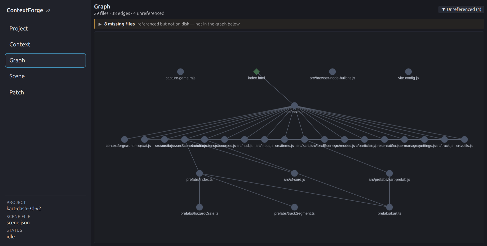

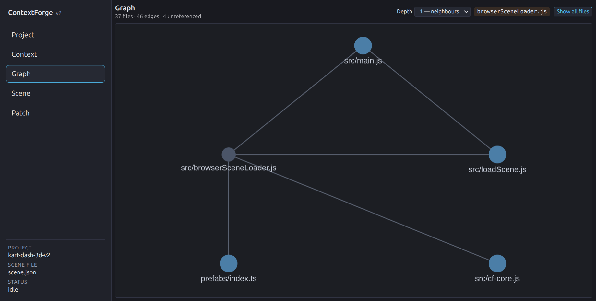

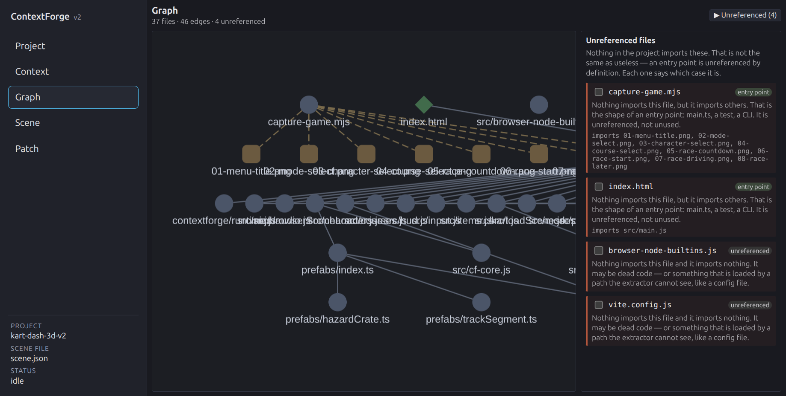

*Checked by:* `packages/core/test/graph/analysis.test.ts` (23),
`packages/core/test/scene/hardening.test.ts` (23),
`packages/app/test/shell/projectGraph.test.ts` (11).

### Reads your project into a dependency graph

`extractJsProject` and `extractGodotProject` walk a project and produce a typed
graph: nodes, edges (`depends_on`, `asset_ref`, `ext_resource`, `signal_connection`,
`requires`), and a contract per node. For JavaScript/TypeScript the contracts come
out of **tree-sitter syntax trees**, never regex — imports, exports, and asset-path
string literals are read from the parse tree.

For Godot it parses `.gd` signals, `@export` vars, constants and enums, and
hand-written `.tscn` files (`[node]`, `[ext_resource]`, `[sub_resource]`,
`[connection]`, with a real tokenizer for the header grammar).

*Checked by:* `packages/core/test/extract/{js,godot,files}.test.ts`,
`packages/core/test/parse/{js,gdscript,tscn,grammars}.test.ts`.

### Deterministic by construction

Two runs over the same project produce byte-identical output. Nothing reads the
clock: `buildManifest` takes `generatedAt` as an argument, which is why the brief
prints a `Generated:` line only when a timestamp was actually injected.

*Checked by:* `packages/core/test/context/brief.test.ts` ("determinism"),
`packages/core/test/extract/js.test.ts`, `packages/core/test/smoke/realProject.test.ts`.

### Builds context for one specific error

Describe what is broken and paste the error; the compiler ranks the files that
matter and gives a reason for each one — `Error origin at line 5`,
`Direct dependency of src/kart.js`, `Exports "kart", named in your description`.
Stack traces are parsed (`res://` prefixes and Windows separators normalised), so
the file the error came from is attached automatically.

If it genuinely cannot see enough, it says `CONTEXT INSUFFICIENT` and names what
it needs rather than guessing.


*Checked by:* `packages/core/test/context/compiler.test.ts`,
`packages/app/test/context/{handlers,contextInsufficient}.test.ts`.

### Applies AI edits through a patch engine that refuses to guess

The Patch screen reads `### FILE:` and `### EDIT:` blocks out of the AI's reply
and shows you the diff and the syntax verdict **before anything is written**.

- **Ambiguous is refused, never guessed.** The finder walks a ladder of passes —
  exact, whitespace-drift, line-number-prefix, blank-line drift — and if a
  snippet matches more than once it stops.
- **All or nothing.** A patch that fails on block 3 of 5 writes none of it.
- **Syntax pre-check before disk.** Invalid JS/GDScript is refused before the
  write, and `applyAnyway` is an explicit override. Hex colours, Windows paths and
  triple-quoted docstrings do not false-flag.
- **Undo names its files.** Undo/redo covers a 20-step history, and the write
  report names every file touched.

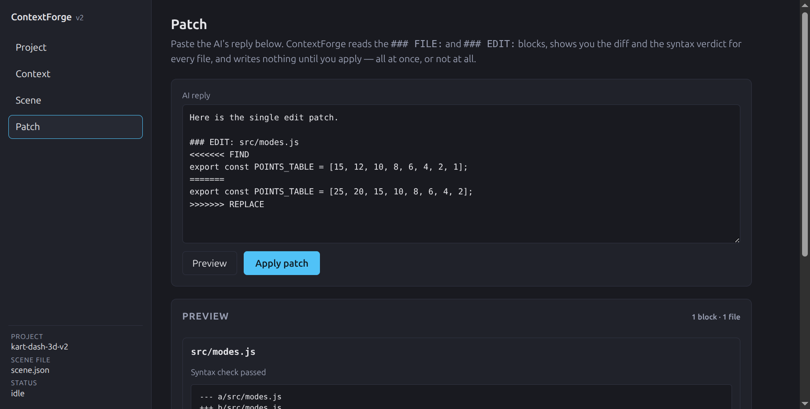

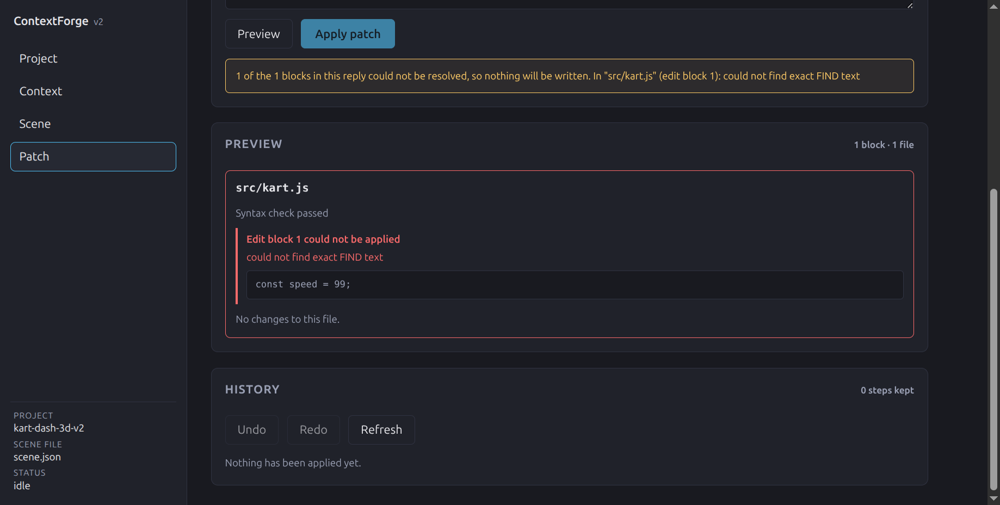

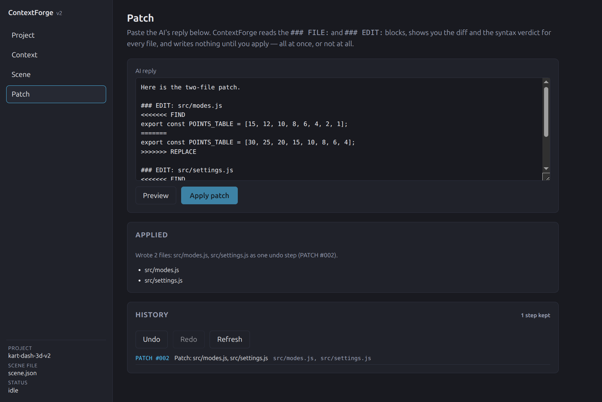

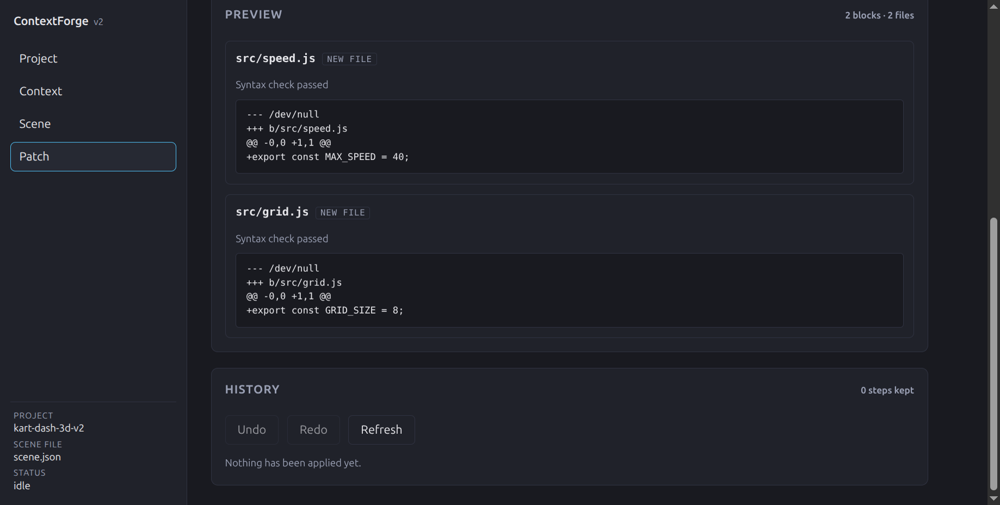

*Checked by:* `packages/core/test/patch/patch.test.ts`,
`packages/app/test/shell/{patchScreen,patchScreenRender}.test.ts`,
`packages/app/test/e2e/patchLoop.test.ts`.

### A `scene.json` contract, and prefabs that are just functions

Scenes are data, validated with a strict Zod schema. Duplicate ids, dangling
parents, self-parenting, two-component positions, unknown keys and a wrong
`schema_version` are all rejected **with the JSON path in the error**. A valid
scene round-trips through load/save unchanged.

A prefab is a pure function:

```ts
type PrefabModule = {
  create(THREE, params, seed) -> { object, parts }
}
```

`THREE` is injected, `params` are validated against the prefab's own Zod schema,
and `parts` is a named map so the editor can select a specific sub-object. A
prefab lint (`npm run lint:prefabs`) rejects `this`, module-level `let`,
`Math.random` and `scene.add` inside a prefab — purity is enforced, not
documented.

If one instance fails, the rest of the scene still builds and the failure is
reported against that instance's id.

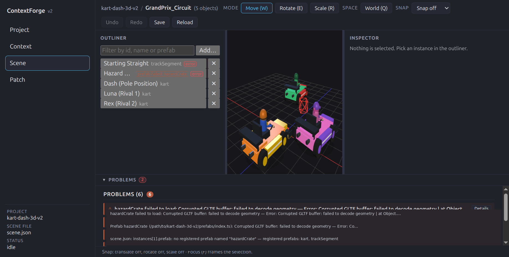

*Checked by:* `packages/core/test/scene/{sceneFile,edits,lint,prefabs,template,slots,rng}.test.ts`,
`packages/core/test/integration/step2.integration.test.ts`,
`packages/app/test/scene/gameScene.test.ts` (a real game loading its real `scene.json`).

### Renders the scene without the game running

Open `scene.json` in the Three.js viewer with no game process attached, edit
transforms, and save — the save re-validates against the schema. The Inspector
edits position, rotation and scale as three discrete axes each, not a matrix.

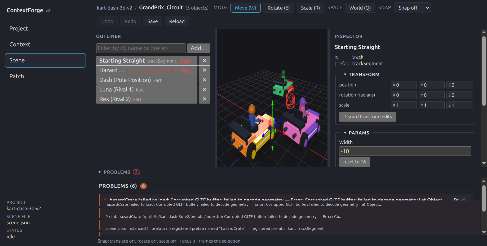

*Checked by:* `packages/app/test/viewport/{assemble,picking,stage,markers,sceneGraph}.test.ts`,
`packages/core/test/integration/step3.e2e.test.ts`.

### Writes a project brief

`generateBrief` builds a `brief.md` describing the project from the graph: the
real public signatures, the folder map, the node and edge counts, the build order
from `layerNodes`, and the patch contract verbatim. Two modes, chosen in the
**Context** screen's header:

- **`oneShot`** puts your typed task in the brief, so the AI answers that task.
- **`interactive`** states no task and instead instructs the AI to reply
  `NEED: <path>` for anything it cannot see, so the files get attached before it
  answers.

The brief is written to `.contextforge/brief.md` inside the opened project and
read back on the next open. One thing the brief deliberately does **not** do is
attach the whole project: files are ranked and the prompt states what was
included and what was not, so you can see what the AI was actually given.

*Checked by:* `packages/core/test/context/brief.test.ts`,
`packages/app/test/context/handlers.test.ts`, `packages/app/test/e2e/briefLoop.test.ts`.

### Starts a new project from a description

**Project → New project…** walks three steps: name it and choose the folder with
the OS dialog, describe the game, take the prompt.

**The prompt cannot be copied until the idea is filled in** — and that gate is
core's own `checkBrief`, the same function `generateProject` refuses on. Not a
reimplementation: a screen that checked differently would enable a copy button
producing a prompt the generator rejects, and the developer would find out only
after pasting it. An empty idea, a whitespace-only one, `"TODO"`, or three words
are each refused with a sentence saying which.

The prompt embeds your description **verbatim**, and states the prefab rules
read from the linter's own rule list — so a rule added to `npm run lint:prefabs`
appears in the prompt instead of quietly drifting from it.

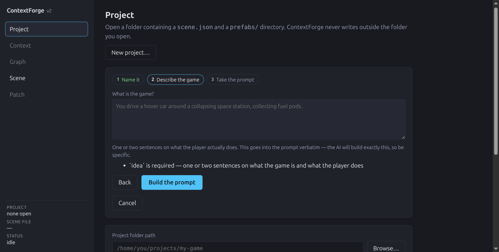

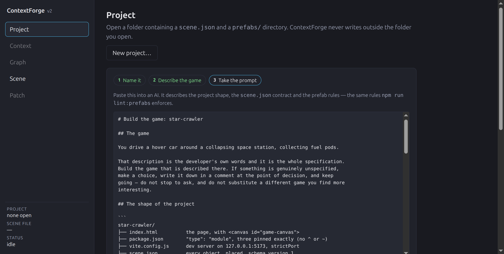

*Checked by:* `packages/core/test/scene/scaffoldPrompt.test.ts` (15),
`packages/app/test/shell/newProject.test.ts` (15).

*Not yet:* this flow stops at the prompt. It does not create the folder — a
native create-folder dialog would need new main-process wiring that would break
the isolation `pickFolder.test.ts` enforces.

### Gates that fail when the rule is broken

These are not comments, they are `npm run verify` stages:

| Gate | Fails when |
| --- | --- |
| `check:boundaries` | any file in `packages/core` imports `@contextforge/app`, or imports outside core's dependency allowlist |
| `check:three` | the viewer and the game project are not on a byte-identical, range-free `three` pin |
| `typecheck` | strict TypeScript reports an error |
| `lint:prefabs` | a prefab uses `this`, module-level `let`, `Math.random` or `scene.add` |

### Verified end-to-end against a real game

The suite drives the real kart game reading its own `scene.json` through its own
prefab registry — no stubs — and checks that a changed position in `scene.json`
moves the kart, looked up by id and never by index. A smoke suite extracts a
whole real project (106 nodes, 248 edges) and detects its real circular import.

The full Electron loops (patch, brief, edit) are **skipped by default** and say
so in their output rather than passing silently. They run when you ask:

```bash
CF_E2E=1 npx vitest run packages/app/test/e2e/patchLoop.test.ts
```

*Honest caveat:* the e2e loops need a game project on disk. Set `CF_PROJECT` to
point at yours; where an external project is missing, those suites skip rather
than fail.

---

## Screenshots

| | |
| --- | --- |
|  |  |
|  |  |
|  |  |
|  |  |
|  |  |
|  |  |

*Every screenshot is from the **real app** driving the real renderer bundle and
the real main process against the real `kart-dash-3d-v2` project — not a mock,
because a mock would prove the CSS renders, which was never in question. Each one
is captured by a harness that **throws rather than photograph a state it cannot
confirm**: `capture-graph.mjs` asserts the node counts it claims to show, and
`capture-newproject.mjs` asserts that no prompt exists while the idea is empty.*

*Two of them had a personal absolute path in the error text; it was replaced
with a neutral placeholder by `scripts/redact-screenshots.py`.*

---

## Install

Requires **Node ≥ 22**. No other prerequisites — the tree-sitter grammars ship
prebuilt binaries, so nothing compiles from source.

**Full setup, including every flag and a troubleshooting section:
[docs/RUNNING.md](docs/RUNNING.md).**

```bash
npm ci
```

> **On `--legacy-peer-deps`.** A `postinstall` note in `package.json` suggests
> it. **You do not need it** — `npm ci` and `npm install` both exit 0, because
> `package-lock.json` is v3 and already records a valid tree, so npm never
> re-checks the peer ranges. The flag matters in exactly one case: if you *delete*
> the lockfile, npm then resolves `tree-sitter@0.21.1` at the root beside a
> nested `0.25.1` in `packages/core`, and the grammar tests break. Keep the
> lockfile.
>
> `npm ls tree-sitter` reports the grammars as `invalid` and exits 1
> (`ELSPROBLEMS`). That is the unsatisfied peer range, not a broken install.
>
> (`package.json` attributes its note to "D17", but `docs/DECISIONS.md` has no
> D17 entry — the numbering jumps from D16 to D20. See
> [docs/DEPENDENCIES.md](docs/DEPENDENCIES.md).)

> **If `npm ci` skipped devDependencies,** you have `NODE_ENV=production` set.
> Install with `NODE_ENV=development npm ci --include=dev` — Electron is a
> devDependency and will otherwise be missing.

### Electron needs one extra step

**`npm ci` does not download the Electron binary.** `electron@44` declares no
postinstall script at all, so npm never fetches the binary and any Electron
command fails with a missing-binary error. Fetch it once:

```bash
node node_modules/electron/install.js
```

(`npx electron --version` downloads on first call instead, but running the
script directly is clearer about what you are doing.)

## Run

```bash
# Dev (Vite dev server for the renderer)
npm run dev -w @contextforge/app

# Build the renderer bundle, then launch Electron
npm run build:ui -w @contextforge/app
npm run start -w @contextforge/app
```

> **`--no-sandbox` is required.** The bundled `chrome-sandbox` helper ships
> unprivileged, and Chromium refuses to start without it. Wherever you launch
> Electron directly, pass the flag:
>
> ```bash
> npx electron --no-sandbox packages/app/dist/electron/main.js
> ```
>
> See [D14](docs/DECISIONS.md). This affects the sandbox helper's permissions,
> not the shipped app.
>
> **Known gap:** `npm run start -w @contextforge/app` builds the renderer and then
> launches Electron *without* `--no-sandbox`, so on this machine it fails at
> launch. The one-liner below is the command that works. The script needs the flag
> added to it.

## Test

```bash
npm run verify      # everything below, in order
npm test            # vitest alone
npm run typecheck   # tsc --build
```

`npm run verify` runs five stages:

1. **`check:boundaries`** — core imports nothing from app; core's dependency
   allowlist is intact.
2. **`check:three`** — the viewer and the game are on the same pinned `three`.
   Needs `CF_GAME_ROOT` if your game is not a sibling directory.
3. **`typecheck`** — strict TypeScript across both packages.
4. **`lint:prefabs`** — prefab purity rules.
5. **`test`** — Vitest across `packages/*/test/`.

Current result: **65 files, 1258 tests, exit 0.**

---

## How it works

### `scene.json`

A scene is data, not code. It is validated against a strict Zod schema, and every
rejection names the offending JSON path:

```
instances[0].params.width: prefab "trackSegment": Number must be greater than 0
```

Placement lives here and nowhere else. `saveScene` re-validates before writing, so
a file on disk is always a scene that would load. `.tscn` is parsed by the
project's own parser rather than converted.

### Prefabs

A prefab is a pure function that returns data. It never imports `THREE` from a
global, never mutates shared state, never randomises without a seed, and never
calls `scene.add` — the caller decides what goes into the scene. That is what
makes the same prefab usable by the editor's viewport and by the game itself,
which is checked directly: the viewer's kart output is compared, combination by
combination, against the v1 game's own `buildMesh()`.

### The patch format

Two block types, both all-or-nothing.

**`### FILE:`** creates or replaces a whole file. `before: null` means the file
did not exist.

```
### FILE: src/speed.js
+export const MAX_SPEED = 40;
```

**`### EDIT:`** replaces a snippet inside an existing file:

```
### EDIT: src/kart.js
<<<<<<< FIND
const speed = 5;
=======
const speed = 25;
>>>>>>> REPLACE
```

For each block: locate the FIND text through a ladder of passes that tolerate
whitespace drift, line-number prefixes and blank-line drift; refuse if the match
is ambiguous or absent; syntax-check the result before touching disk. A patch
that fails on any block writes none of them.

---

## Project structure

```
contextforge-v2/
├── packages/
│   ├── core/        @contextforge/core — the engine. No UI, no DOM.
│   │   ├── src/
│   │   │   ├── parse/     tree-sitter grammars; js / gdscript / tscn readers
│   │   │   ├── graph/     the node+edge model, manifest, reverse queries
│   │   │   ├── extract/   a project on disk → a graph
│   │   │   ├── patch/     FIND/REPLACE engine, FILE/EDIT blocks, syntax check
│   │   │   ├── history/   20-step undo/redo
│   │   │   ├── scene/     scene.json schema, load/save, edits, prefabs
│   │   │   └── context/   rank, compile, slice, brief
│   │   └── test/
│   └── app/         @contextforge/app — the Electron + Svelte shell.
│       ├── src/
│       │   ├── electron/   main, preload, IPC handlers, prefab loader
│       │   └── renderer/   Svelte screens and components
│       └── test/
├── docs/            SPEC-linked architecture, decisions, dependencies
├── scripts/         verify gates and e2e harnesses
└── screenshots/     raw captures, by iteration
```

**The boundary rule: `packages/core` has zero third-party UI dependencies, no
DOM globals, and never imports from `packages/app`.** Core is where the logic
lives and it is testable headlessly; the app is a shell over it. `npm run
check:boundaries` fails the build if that is ever violated, so the rule is
mechanical rather than aspirational.

---

## Tech stack

Pinned versions read from `package-lock.json`:

| Package | Version | Role |
| --- | --- | --- |
| `typescript` | 5.9.3 | strict TS across both packages |
| `vitest` | 5.0.3 | test runner |
| `vite` | 6.4.3 | dev server + renderer bundle |
| `electron` | 44.5.1 | desktop shell |
| `svelte` | 5.57.1 | renderer UI |
| `@sveltejs/vite-plugin-svelte` | 5.1.1 | Svelte in Vite |
| `three` | 0.180.0 | scene viewer (exact pin, no range) |
| `zod` | 3.25.76 | manifest + scene.json validation |
| `tree-sitter` | 0.25.1 | parser runtime |
| `tree-sitter-javascript` | 0.23.1 | JS grammar |
| `tree-sitter-typescript` | 0.23.2 | TS/TSX grammar |
| `tree-sitter-gdscript` | 6.1.0 | GDScript grammar |
| `esbuild` | 0.25.12 | bundles a project's real prefabs |
| `@electron/rebuild` | 4.2.0 | rebuilds native grammars for Electron |
| `cytoscape` | 3.34.3 | draws the Graph screen |

Licences and the reasoning behind each choice: [docs/DEPENDENCIES.md](docs/DEPENDENCIES.md).

---

## Status and roadmap

Built in sequential steps, each with a done-when test that had to be green
before the next began.

| Step | Status |
| --- | --- |
| 1 — Core: graph, parsers, extractors, patch engine, history | **done** |
| 2 — Scene contract: `scene.json` schema, load/save, prefab lint | **done** |
| 3 — Modeling viewer: `scene.json` rendered with no game running | **done** |
| 4 — UI shell: Electron + Svelte, four screens | **done** |
| 5a — Graph screen: the dependency graph, drawn | **done** |
| 5b — Focus mode: one file's neighbourhood, depth 1 or 2 | **done** |
| 5c — Orphans drawer: unreferenced files, with reasons | **done** — attach-to-context records the selection; it does not yet feed a compiled prompt |
| 5d — New Project: 3 steps, gated on a real idea | **done** — stops at the prompt; does not create the folder |
| 5e — Hardening: empty, 1,000-file, broken folders | **done** |
| 5f — Brief ask-back mode | **not started** |
| 6+ | not planned |

### What Step 5f still owes

A **Project Brief** button in two modes. Both modes already build and write
`.contextforge/brief.md`, read it back, and detect `NEED: <path>` so a requested
file is attached in full on the next turn — covered by the e2e brief loop against
a real project.

- One-shot produces a brief from core's graph with **no network call** — true
  today.
- The **ask-back** mode asks exactly one clarifying question before generating a
  different brief. The current second mode is **interactive** (the AI asks for
  missing files), which is *not* the same thing: it defers the question to the
  AI instead of asking one itself. This is the substantive gap.
- Neither mode writes to the project without an explicit apply. `brief.md` goes
  under `.contextforge/` and nothing else is touched, but the guarantee is not yet
  asserted end to end.

Nothing beyond Step 5f is committed to.

### Known gaps

Four things this project does not do yet. Each is stated here rather than
discovered later.

**1. The clipboard copy is untested.** Every "Copy" button calls
`navigator.clipboard.writeText`, and **no test asserts that the bytes land.** This
repo has no jsdom and no mounted-DOM harness, so the buttons are covered at the
level of *"is it enabled"* and *"does clicking it not throw"* — never *"did the
clipboard receive the prompt"*. The two pre-existing copy buttons on the Context
screen have no test either. If you are relying on a copy button, paste the result
somewhere and check it.

**2. The test game reports 4 unreferenced files.** In
`kart-dash-3d-v2`, the Graph screen's drawer lists four files nothing imports:

| File | Why core flags it | Is it live? |
| --- | --- | --- |
| `index.html` | `entry point` — it loads `src/main.js` via a `<script>` tag, so it has a real dependency. Nothing imports an HTML file. | **Yes.** Vite finds it by convention. |
| `capture-game.mjs` | `entry point` — only because the screenshot filenames in its source parse as asset references. Delete those strings and the label would change. | **Yes** — it drives the game. It is not runnable from the game project though: it imports `electron`, which is not one of its dependencies. |
| `src/browser-node-builtins.js` | `unreferenced` — Core discards every `node:` specifier, and a Vite plugin redirects `node:fs`/`node:path` to this file at resolve time. No source imports it, so no edge can exist. | **Yes, load-bearing.** Delete it and `vite build` breaks — `cf-core.js` reaches core through it. |
| `vite.config.js` | `unreferenced` — loaded by the build tool, not by the game. | **Yes.** |

**None of the four should be deleted.** The two labelled `unreferenced` are live
and load-bearing, which is worth stating outright: `unreferenced` is the same
label Core gives a genuinely dead file, so a reader skimming the drawer rather
than this README would reasonably mistake those two rows for deletion candidates.

The classifier itself keys on whether a file has **any** resolved dependency, not
on whether it is an entry point. `index.html` and `capture-game.mjs` both have
non-empty `depends_on`; a CLI importing only `node:fs` would be labelled plain
`unreferenced` despite being an entry point.

> **Why 29 files and not 37.** Eight of them used to be drawn: `capture-game.mjs`
> names screenshot filenames in its source, and Core built a node for each
> without checking that the file existed. They are not in the game, so the graph
> asserted eight files a developer could not open. A reference to a file that is
> not on disk now produces a **Missing files** warning under the header instead of
> a node — a graph node is a claim that the file exists, and this one was false.
> See [D48](docs/DECISIONS.md).

**3. Attach to context records a selection; it does not use it.** Ticking a row in
the unreferenced drawer highlights it and reports *"N file(s) attached"*. It does
**not** yet put those files into a compiled prompt.

**4. New Project produces a prompt, not a folder.** The three steps end at a
copyable prompt. The folder is never created, because a native create-folder
dialog would need new main-process wiring that breaks the isolation
`pickFolder.test.ts` enforces.

Also worth knowing: **`findCycles` is super-linear** — 33× for a 10× input, since
each cycle is canonicalised by sorting its node list. 11 ms at 1,000 files, so
this is a complexity note rather than an active problem. Logged in
[D47](docs/DECISIONS.md), not fixed.

The Electron e2e loops are skipped by default and **say so in their output**
rather than passing silently.

Step boundaries and their done-when tests: [SPEC.md §5](SPEC.md). The reasons
behind each choice, including the gaps accepted on purpose, are in
[docs/DECISIONS.md](docs/DECISIONS.md) (D1–D47). What was built in Step 5 and
what was proven: [docs/OVERNIGHT.md](docs/OVERNIGHT.md).

---

## Licence

MIT — see [LICENSE](LICENSE).